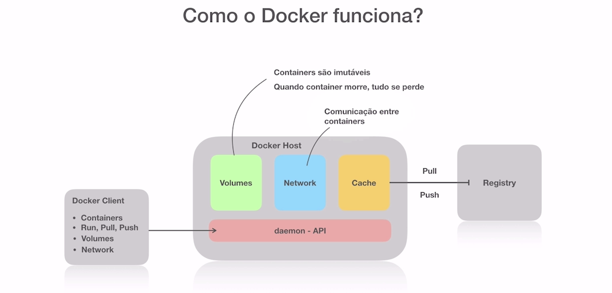

# Full Cycle

# Docker


1 - Containers:
- Containers são na verdade processos isolados que simulam um sistema operacional.
- CGroups permitu separa recursos(memória, trehads) para determinado processo.
- OFS (Overlay File System), para cada nova imagem criada não se repete dependências já instaladas mas sim as que foram alteradas.
- Containers são imutáveis, não faça alterações nos arquivos dos containers pois após você matar o processos as mudanças seram perdidas.

2 - Imagens:
- São camadas de dependências e essas mesmas dependências podem ser usadas em outras imagens.
- https://hub.docker.com/ 

3 - Dockerfile:
- Arquivo declarativo para construir imagens
FROM: Nome da Imagem
RUN: Comando executados no terminal do container
EXPOSE: Porta a ser exposta
COPY: Copia uma pasta local para dentro do container
WORKDIR: Cria uma pasta dentro do container
CMD: Comandos sh (Obs: Os comandos podem ser substituidos no comando de executação)
ENTRYPOINT: Comandos sh (Obs: é um comando fixo sempre será executado e será executado primeiro que o CMD)


4 - Volumes
- Os volumes fazem o docker compartilhar uma pasta local junto a imagem docker para que os arquivos não sejam perdidos.

5 - Network
- O Network permite que as imagens se comuniquem dentro do docker.
- bridge: quando não se passa parametros e apenas é criado um network é chamado de bridge
- host: permite o container acessar a máquina local pelo host.
- overlay: faz a comunicação de vários dokcers.
- none: serve para rodar o container de forma isolada.
- host.docker.internal:8000 consegue acessar a porta local peelo container.

5 - Healthcheck
- É possível adicionar um verificador de status da sua imagem para saber se ela está rodando ou não.

6- Economizar espaço (processo  multistage)
- Para imagens compiladas como o go podemos adicionar outra imagem chamada de scrath que é totalmente vazia e adicionamos apenas o arquivo de execução e o command para rodar.

7 - DockerHub
- É possível criar uma imagem e subi-lá no DockerHub para se tornar uma imagem pública.
    - docker login
    - docker push nome_imagem
- Consulta de imagens
    - docker search nome-da-imagem

8 - Docker-compose
- É um conjunto de instruções que são executadas automaticamente para criação dos containers. Você pode passar:
    image:
        Especifica a imagem Docker para o serviço.

    build:
        Define as instruções para construir a imagem do Docker.

    command:
        Sobrescreve o comando padrão especificado pela imagem.

    ports:
        Mapeia as portas do host para as portas do container.

    volumes:
        Monta volumes do host no container para persistir dados.

    environment:
        Define variáveis de ambiente no container.

    env_file:
        Especifica um arquivo que contém variáveis de ambiente.

    depends_on:
        Define serviços dependentes.

    networks:
        Configura redes personalizadas para os serviços.

    restart:
        Controla o comportamento de reinicialização do serviço.

    ports:
        Mapeia as portas do host para as portas do container.

    entrypoint:
        Sobrescreve o ponto de entrada padrão.

9 - Entrypoint  e Cmd
### Entrypoint
Define o comando que sempre será executado quando o container iniciar. Não pode ser sobrescrito ao executar `docker run`, a menos que a opção `--entrypoint` seja usada.
Exemplo no Dockerfile:
```dockerfile
ENTRYPOINT ["executable", "param1", "param2"]
```
### CMD
Define o comando padrão que será executado quando o container iniciar. Pode ser sobrescrito ao executar docker run com outros argumentos.

Exemplo no Dockerfile:
```dockerfile
CMD ["param1", "param2"]
```
10 - Labels
As labels são usadas para adicionar metadados aos containers, imagens, volumes ou redes. Elas ajudam a organizar, buscar e gerenciar recursos Docker.

Exemplo no Dockerfile:
```dockerfile
LABEL maintainer="seu_nome@example.com"
LABEL version="1.0"
LABEL description="Descrição da sua aplicação"
LABEL env="production"
```
11 - ONBUILD
A instrução `ONBUILD` adiciona um gatilho à imagem que será executado quando uma imagem derivada for construída. É útil para criar imagens base que outras imagens podem herdar.

Exemplo no Dockerfile:
```dockerfile
ONBUILD ADD . /app/src
ONBUILD RUN /usr/local/bin/python-build --dir /app/src
```


12 - Comandos:.
Mostra os containers que estão rodando.
```bash
$ docker build -t nome_da_imagem .
```
Mostra os containers que estão rodando e os que já executaram mas foram abortados. 

```bash
$ docker ps
```
Mostra os containers que estão rodando e os que já executaram mas foram abortados.
```bash
$ docker ps -a
```
"-i" significa interativo, fazendo com que seu terminal fique ligado diretamente no container.
"-t" signfica TTY, possibilita digitar comandos no terminal.
```bash
$ docker run -it ubuntu bash
```
"--rm" após encerrar o container ele apagará seu histórico.
```bash
$ docker run -it --rm ubuntu bash
```

"-p" passa a porta local (8080) que apontará a porta do conatiner (80)
```bash
$ docker run -p 8080:80 nginx
```

"-d" desacopla o terminal do container e "--name" passa o nome do container
```bash
$ docker run --name ngnix -d -p 8080:80 nginx
```

"start" inicia o container 
```bash
$ docker start nome_container
```

"rm" remove o container e "-f" força a remoção
```bash
$ docker rm nome_container -f
```
o "exec" executa comando dentro do container. No exemmplo abaixo ele irá retornar os arquivos que estao no container.
```bash
$ docker exec nome_container ls
```
Já no exemplo abaixo ficamos dentro do container com o bash ativo.
```bash
$ docker exec -it nome_container bash
```

Lista as imagens baixadas no seu computador
```bash
$ docker images
```

"rm" remove a imagem 
```bash
$ docker rmi nome_imagem
```

"$(pwd)" pega o caminho da pasta atual 
```bash
$ docker run --rm -it -v $(pwd)/:/usr/src/app -p 3000:3000 node:15 bash
```

Remove todos os containers 
```bash
$ docker rm $(docker ps -a -q) -f
```

Atachar terminal no container
```bash
$ docker attach imagem
```


 Aula
 [] #F0040
 