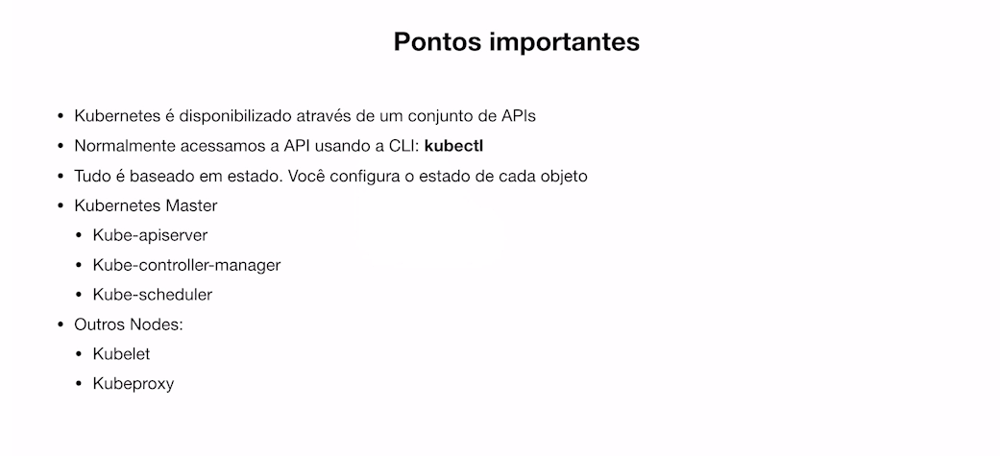
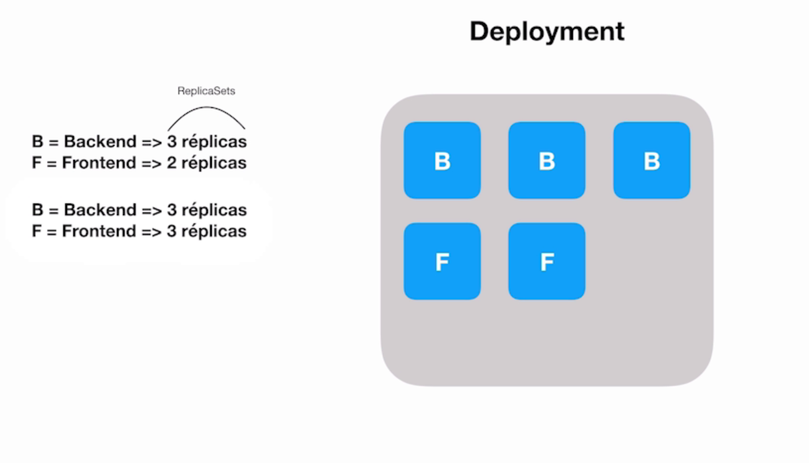

## Kubernetes
- É um serviço open source utilizado para implantação, o dimensionamento e gerencionamento de aplicativos em contêiner.
- Normalmente acessamos via CLI: `kubecli`

- `Cluster` conjunto de máquinas(nodes)
- `Pods` unidade que contém os containers

## Pontos importantes



### Deployment
O k8 tem acesso ao recurso de cpu e máquina dos clusters e com isso ele pode gerenciar seus recursos então por exemplo, podemos 
utilizar réplicas de pods como segurança mas o kubernete não te permite exceder seu hardware.




## Replicaset
Quando subimos um pod e o mesmo der algum problema ou for deletado não iremos conseguir subir novamente. Entretanto, podemos utilizar réplicas e passar
o número minimo de apps que precisamos ent mesmo que um caia automaticamente sera gerado outro.
Porém temos um problema que para cada nova versão para os podis serem atualizados eles tem que ser reinicados então por isso usando o `Deployment`
o fluxo é `deployment->replicaset->pod`.
O deployment gerencia as replicas para que quando haja alteração ele reiniciais gradualmente cada pod.

## Rollout
Se você precisa retornar uma versão anterior você pode usar o comando 

```cmd
kubectl rollout undo deployment <nome-do-pod>
```

Caso precise voltar uma versão especifica passe a flag --to-revision

```cmd
kubectl rollout undo deployment <nome-do-pod> --to-revision=<n-versao>
```

Além disso você pode também ver o histórico de versões
```cmd
kubectl rollout history deployment <nome-do-pod>
```

## Services
Através do services que temos acessos as nossas aplicações. Servindo como um intemediardor e até como balanceador, podemos filtrar um conjunto de pods que o service pode gerenciar então para ter acesso a determinada aplicação tudo passara por ele.
Temos três tipode service: ClusterIP , NodePort , LoadBalancer

ClusterIP: podemos fazer similar ao proxy reverso quando passamos a port estamos passando a porta que vamo acessar o service já o targetPort poassamos
a porta que o conatiner esta rodando então bateremos na porta service:80 que vai apontar para container:800. Lembrando que ele cria um ip interno.

```yaml 
apiVersion: v1
kind: Service
metadata:
  name: goserver-service
spec:
  selector:
    app: goservers
  ports:
    - name: goserver-service
      port: 80
      targetPort: 8000
      protocol: TCP
  type: ClusterIP
```
O `selector` vai ajudar a fazer o filtro dos pods


NodePort: quando precisamos acessar o cluster de fora de sua rede utilizamos o NodePort. Então, o que vai acontecer é que em todos os nodes a porta
3001 será aberta, caso você acesse por essa porta irá para o service goserver-service:80 que te jogara para o container:8000
```yaml 
apiVersion: v1
kind: Service
metadata:
  name: goserver-service
spec:
  selector:
    app: goservers
  ports:
    - name: goserver-service
      port: 80
      targetPort: 8000
      protocol: TCP
  type: NodePort
```

LoadBalancer: criar um ip externo usando o nodeport e é comumente usado quando se está em um cloud provider, então se cria esse external-ip que através dele você tem acesso ao service, podendo ser usado no dns
```yaml 
apiVersion: v1
kind: Service
metadata:
  name: goserver-service
spec:
  selector:
    app: goservers
  ports:
    - name: goserver-service
      port: 80
      targetPort: 8000
      protocol: TCP 
  type: LoadBalancer
```

## ConfigMap e Secrets
- Podemos passar envs para os containers criando um ConfigMap onde adicionamos os valores que podem ser importandos tanto para envs quando injetando no volume do container
- Para dados mais sensíveis usamos o secret, porém ele só bota em base64

## Health
- Ultizamos o health para verificar os estados da nossa aplicação se ela está apita ser usada ou ainda está carregando ou até mesmo sem funcionar.

### Liveness
- O `LivenessProbe` pode agir de três formas como CLI executando comandos, Http fazendo requisições e TCP tentando fazer uma conexão e se caso der errado ele reinicia o container.
- `periodSeconds` a cada quantos segundos ele vai fazer a requisição.
- `failureThreshold` quantas vezes precisar da errado para ele falar que a aplicação caiu.
- `timeoutSeconds` quanto tempo deve demorar a respota da requisição.
- `sucessThreshold` quantas vezes esse processo tem que dar certo.
- `initalDelaySeconds` tempo de espera para começar a executar as verificações.

### Readiness
- O `ReadinessProbe` verifica se a aplicação está ready, então ele pode utilizar dos mesmos recursos que o `LivenessProb` para fazer essa verificação. No caso ele muda o tráfego caso não esteja ready enquanto o liveness restart o container.

### StartupProbe
- Para não conflitar a inicialização do container com `rediness` e `liveness` foi criado o startup que vai avisar quando ambos podemos começar a agir após ele mesmo verificar se a aplicação está ok.


```yaml
livenessProbe:
  httpGet:
    path: /healthz
    port: 8000
  periodSeconds: 2
  failureThreshold: 1
  timeoutSeconds: 10
  sucessThreshold: 1
```
## Resources
- Agora falando sobre recursos físicos, o k8 tem que gerenciar o quanto ele pode gastar e qual mínimo ele tem que reservar para
seu node funcionar e por isso tempos os campos `request` que passamos o mínimo de cpu e memory e `limits` vai ter o máximo de uso.


## HPA
- Para configurar o k8 de como ele deve gerenciar a criação de pods com base no uso utilizamos o `hpa`

```yaml
apiVersion: autoscaling/v1
kind: HorizontalPodAutoscaler
metadata:
  name: goserver-hpa
spec:
  scaleTargetRef:
    apiVersion: apps/v1
    kind: Deployment
    name: go-server
  minReplicas: 1
  maxReplicas: 5
  targetCPUUtilizationPercentage: 30

```

## Comandos
conectar seu pc no container do kubernetes para ter acesso a api
```cmd
kubectl proxy --port=8080
```

```cmd
kubectl config get-clusters
```

```cmd
kubectl config use-clusters nome_do_cluster
```


#F0112